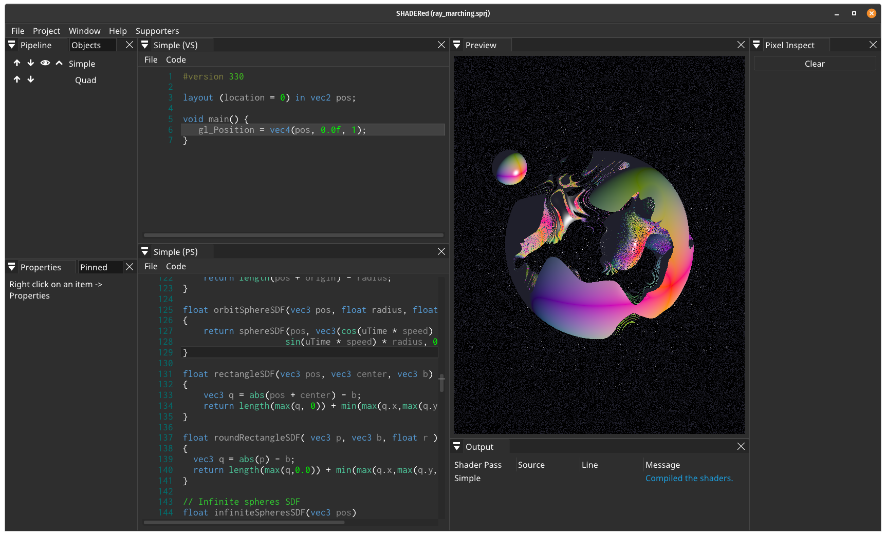

# GLSL Ray Marching shader

A GLSL implementation of the [ray marching algorithm](http://jamie-wong.com/2016/07/15/ray-marching-signed-distance-functions/)


(the final gif was composited in [Blender](blender.org) for bloom and lens distortion effects)

## Description

This project was made at ArtFX - TD 4.

## Getting Started

### Dependencies

This project was made using [SHADERed](https://shadered.org/), an open source fully featured shader IDE.



### Installing

You can install SHADERed [here](https://github.com/dfranx/SHADERed/releases).

### Executing program

You can open the project with the IDE (assuming that SHADERed and the project are in the same folder) : 

```
$ ./SHADERed/SHADERed ./ray_marching_shader/ray_marching.sprj
```

The shaders are located here : 

```
└── shaders
    ├── ray_marching_PS.glsl
    └── ray_marching_VS.glsl
```

### Ressources

- https://computergraphics.stackexchange.com/questions/161/what-is-ray-marching-is-sphere-tracing-the-same-thing/163
- https://michaelwalczyk.com/blog-ray-marching.html
- https://www.iquilezles.org/www/articles/raymarchingdf/raymarchingdf.htm (co founder of ShaderToy and guru of ray marching!)
- https://github.com/electricsquare/raymarching-workshop
- https://www.thebookofshaders.com/
